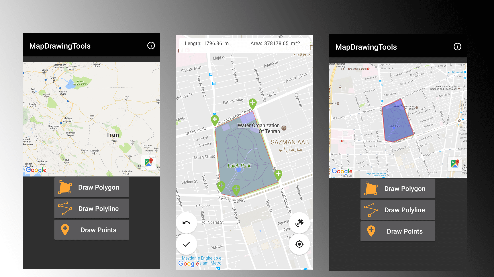
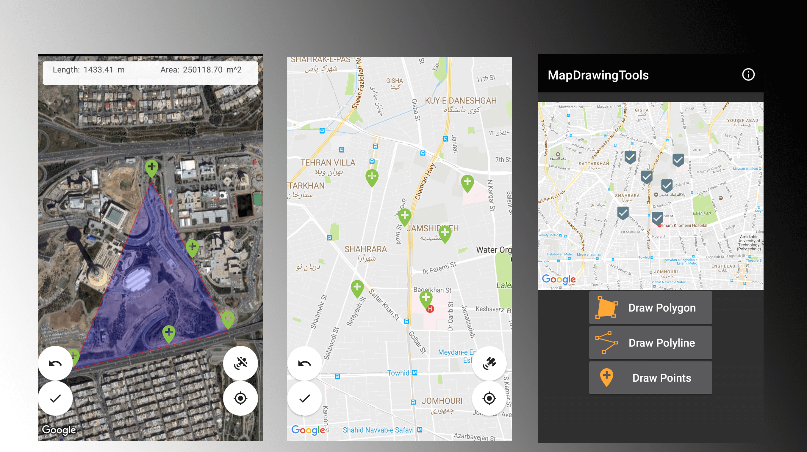
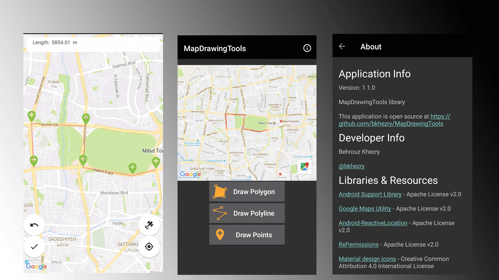

## simple library for manually Drawing element of Map and return them to main Application

[](https://jitpack.io/#bkhezry/MapDrawingTools)
[](https://travis-ci.org/bkhezry/MapDrawingTools)
[](https://android-arsenal.com/details/1/5760)

MapDrawingTools is an android library to Drawing manually polygon, polyline and points in the Google Map and return coordinates from library to your App. this library useful for application that pick multiple point or drawing border of land to get data from users.

**Project Setup and Dependencies**
- JDK 8
- Android SDK Build tools 28.0.3
- Supports API Level +17
- AppCompat & Cardview libraries androidx 1.0.0
- Google Play Services Maps 16.0.0

**Highlights**
- Add point of `Polygon`, `Polyline` and `Markers` with Tab on the Map
- Relocation all Markers and draw them with dragging the Markers.
- Supports calculating `area` of polygon & `length` of polyline
- Supports Undo point inserted to the Map

# Preview
## Demo
### Youtube
<a href="http://www.youtube.com/watch?feature=player_embedded&v=r0vnjlv77F4
" target="_blank"></a>

You can download the latest demo APK from here: https://github.com/bkhezry/MapDrawingTools/blob/master/assets/DemoMapDrawingTools.apk

## Screenshots




# Setup
## 1. Provide the gradle dependency
Add it in your root build.gradle at the end of repositories:
```gradle
allprojects {
	repositories {
		...
		maven { url "https://jitpack.io" }
	}
}
```
Add the dependency:
```gradle
dependencies {
	implementation 'com.github.bkhezry:MapDrawingTools:1.1.3'
}
```

## 2. Add your code
add MapsActivity to yout app AndroidManifest file
```xml
<activity android:name="com.github.bkhezry.mapdrawingtools.ui.MapsActivity" />
```
set theme of this activity to custom `Theme.AppCompat` that contain two items.
```xml
<item name="windowActionBar">false</item>
<item name="windowNoTitle">true</item>
```
in your app add this code:
```java
DrawingOption.DrawingType currentDrawingType = DrawingOption.DrawingType.POLYGON;
Intent intent =
	new DrawingOptionBuilder()
		.withLocation(35.744502, 51.368966)
		.withMapZoom(14)
		.withFillColor(Color.argb(60, 0, 0, 255))
		.withStrokeColor(Color.argb(100, 255, 0, 0))
		.withStrokeWidth(3)
		.withRequestGPSEnabling(false)
		.withDrawingType(currentDrawingType)
		.build(getApplicationContext());
startActivityForResult(intent, REQUEST_CODE);
 ```
 ## DrawingOption attributes

| Name | Type | Default | Description |
|:----:|:----:|:-------:|:-----------:|
|locationLatitude|Double|@NoneNullable| latitude of center map |
|locationLongitude|Double|@NoneNullable| longitude of center map |
|zoom|float|14| zoom of map|
|fillColor|int|Color.argb(0, 0, 0, 0)|only use in polygon for fill color|
|strokeColor|int|Color.argb(255, 0, 0, 0)|strock color of polygon and polyline|
|strokeWidth|int|10|strock width of polygon and polyline|
|enableSatelliteView|boolean|true|show switch between satellite or default map icon|
|requestGPSEnabling|boolean|false|request for turn on GPS in start of activity|
|enableCalculateLayout|boolean|true|show layout of calculated area and length top of MapView|
|drawingType|DrawingType|POLYGON|type of drawing|

 value of DrawingType: POLYGON, POLYLINE, POINT
 
### Get Data
after drawing element and click on Done icon, data will be return to your activity
```java 
@Override
protected void onActivityResult(int requestCode, int resultCode, Intent data) {
if (resultCode == RESULT_OK && requestCode == REQUEST_CODE && data != null) {
	DataModel dataModel =
                    data.getExtras().getParcelable(MapsActivity.POINTS);
	LatLng[] points=dataModel.getPoints();
  }
}
```
# Developed By

* Behrouz Khezry
 * [@bkhezry](https://twitter.com/bkhezry) 

# Credit
spacial thanks [Leku](https://github.com/SchibstedSpain/Leku/)

# License

    Copyright 2017 Behrouz Khezry

    Licensed under the Apache License, Version 2.0 (the "License");
    you may not use this file except in compliance with the License.
    You may obtain a copy of the License at

       http://www.apache.org/licenses/LICENSE-2.0

    Unless required by applicable law or agreed to in writing, software
    distributed under the License is distributed on an "AS IS" BASIS,
    WITHOUT WARRANTIES OR CONDITIONS OF ANY KIND, either express or implied.
    See the License for the specific language governing permissions and
    limitations under the License.
